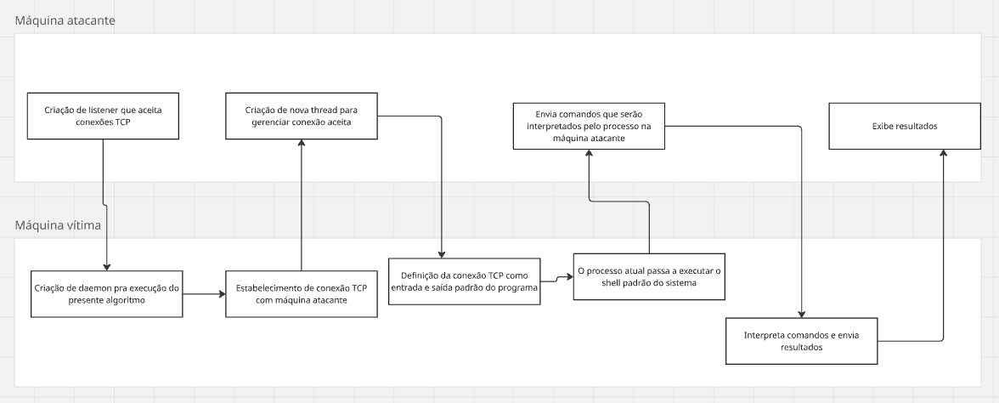

# TI0174 - Sistemas Operacionais: Trabalho final
## Integrantes da equipe:
- Leonardo Dayvison Silva de Almeida Teixeira
- Ludmila Maria Pires de Oliveira
- Maria Lissa Rodrigues Costa
- João Victor Carneiro de Oliveira

## Descrição do projeto
O projeto consiste em uma implementação básica de um reverse shell, uma técnica de infiltração que explora uma vulnerabilidade dos sistemas NAT. Uma vez que esses sistemas, por padrão, aceitam receber pacotes de conexões cujo próprio host estabeleceu, o programa permite que outra máquina execute comandos no shell da máquina atacada remotamente, via conexão TCP. A seguir, uma versão simplificada do algoritmo implementado:
1. A máquina atacante cria um listener, ou seja, um socket que escuta e aceita conexões TCP
2. O programa na máquina vítima cria um processo filho que roda em segundo plano, enquanto o processo pai roda quaisquer funcionalidades desejadas pelo usuário
3. O processo filho estabelece uma conexão TCP com a máquina atacante, que o aceita automaticamente
4. A máquina atacante cria uma thread para cada conexão aceita, evitando travamento em caso de mais de uma vítima conectada
5. O processo filho muda as entradas e saídas padrão para a conexão TCP (ao invés de teclado e mouse, como padrão)
6. O processo filho usa a chamada de sistema execve() para executar o shell padrão do sistema
7. A máquina atacante agora pode enviar mensagens pela conexão, que serão interpretados pelo shell rodando na máquina vítima, obtendo acesso mínimo ao sistema da vítima

## Conceitos da disciplina abordados no projeto
- Processos: criação de daemon para execução de código malicioso sem percepção do usuário
- Threads: Multithreading para evitar travamento do processo servidor na máquina atacante
- Chamadas de sistema: criação de sockets TCP, redirecionamento de entrada e saída padrão, substituição de programa que é rodado em certo processo

https://canva.link/7shjibyjulnfcz3
